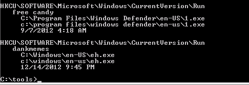

# ICC Security - Exercise 03 - Techniques

## Q1


```
SAb45b.exe
1.exe
```

## Q2

Which vendor gave the name "FakeAlert-AVPsec" to this malware?

```
McAfee
```

https://www.microsoft.com/en-us/wdsi/threats/malware-encyclopedia-description?Name=SecurityShield

## Q3-8

Refer to: https://translate.google.com/translate?hl=en&sl=ja&u=http://yoo2.blog50.fc2.com/blog-entry-2831.html&prev=search&pto=aue

## Q9

Using Process Monitor sysinternals tool to view Process Tree.


```
eh.exe (PID 3492)
nc.exe (PID 1528)
```

## Q10

There are no socket/network connections found related to this malware.

```
False - there is a UDP socket associated with the eh.exe process ID

UDP     127.0.0.1:51661
```


## Q11



```
HKCU\SOFTWARE\Microsoft\Windows\CurrentVersion\Run\ - "dankmemes"
HKCU\SOFTWARE\Microsoft\Windows\CurrentVersion\Run\ - "free candy"
```

## Q12

Using the sigcheck command perform a MD5 hash sum on the discovered malware.

Document the other file names of the malware found and what site was used to identify it.

Use this format for your answer: filename, sitename

```
unpack.exe, VirusTotal
```

`7da7170b0a80f01397d43d0fd7d96595`


`60bcb0e1b9ae5a9b50dcff7decd656ae`


`E757D1D36E0978675811F804DCEC17FE`


## Q13

```
Yes
```


## Q14


## Q16

VirusTotal info about the "eh.exe" malware (found using MD5 filehash) does not indicate the malware has mass mailer capabilities.
