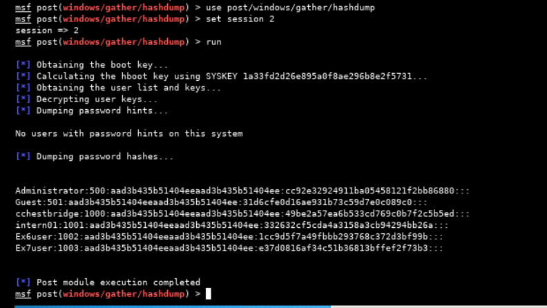

# ICC Security - Exercise 04 - Security

- Log on to Win7 as user "cchestbridge".
- Open Administrator cmd prompt.
- Execute following command:
  - `nc -l -p 3978 -e cmd.exe`


- Setting up bind_tcp handler on Kali box (10.10.1.60)


- Meterpreter session upgrade did not work. Error message presented on Win7 machine:


- Kill the job started to handle the reverse connection from meterpreter session.
- Try to upgrade the shell session again.


## Q1

Document the full path of the four most common registry keys/values used to provide application persistence.

```
HKLM\Software\Microsoft\Windows\Currentversion\Run

HKLM\Software\Microsoft\Windows\Currentversion\RunOnce

HKCU\Software\Microsoft\Windows\Currentversion\Run

HKCU\Software\Microsoft\Windows\Currentversion\RunOnce
```

## Q2

What is the date and time on the target?


## Q3

Identify and document the name of the target machine.

```
EX-WIN7
```


## Q4

Identify and document the operating system and service pack (if any).

```
Windows 7 (Build 7601, Service Pack 1)
```

## Q5

SYSTEM is the authority/account that is running.

```
False

> The session is running as the account used to run the original nc command on the Win7 machine.
```

## Q6

What PID and process is Meterpreter injected into?


```
PID 3216 (YAkQK.exe)
```

---

## Privilege Escalation

Check current privilege in meterpreter session with:
`run post/windows/gather/win_privs`


Migrate to another less obvious SYSTEM process:


---

## Q7

Identify and document the suspect's account name.

```
cchestbridge
```


## Q8

What is the IP address of the target?

```
10.10.1.30
```


## Q9

Identify the Meterpreter reverse shell process.

```
PID 3216 (YAkQK.exe)
```


## Q10

What security product is present?

```
MS Security Essentials
```

- Looking at process list does not indicate individual process tied to a particular security product.
- Looking at services running in each process, there is an instance of svchost.exe (PID 2632) running the "WinDefend" service, which is part of MS Security Essentials.


## Q11

What is the name of the executable associated with the security product?

```
svchost.exe
```


## Q12

What is the display name of the security product?

```
Windows Defender
```

## Q13

Document the full directory path from which the security product is running.

```
C:\Windows\System32
```

## Q14

The only established network connections originate from the current operation.

```
True

> Only two ESTABLISHED network connections exist, relating to the two sessions with the target box (nc.exe - cmd shell, and YAkQK.exe - meterpreter reverse shell).
```


---


---

## Q19

The actions of this operation were logged by the security product.

```
False
```


---




---
