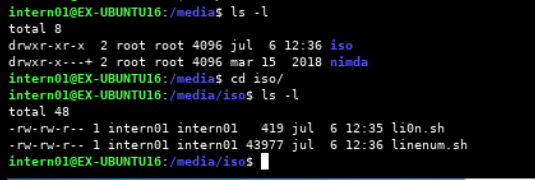
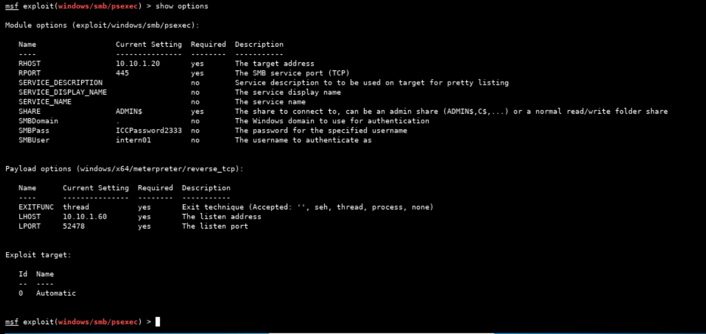
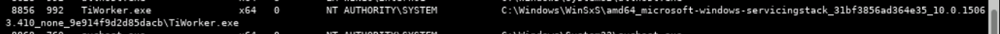

# ICC Security - Exercise 05 - Situational Awareness UNIX

---


## Q1

Analyze the FTP session log and determine the activity taking place.

```
- First client successfully connects from IP address 192.168.27.121
- First client uploads two files, with first file failing twice before succeeding on third attempt:
    - /home/files/ftp/RTR-CORE-1-s1.cfg
    - /home/files/ftp/RTR-CORE-1-s3.cfg
- Second client already connected to FTP server before log extract started (192.168.37.121) uploads following file:
    - /home/files/ftp/RTR-CORE-1-s2.cfg
- Third client (192.168.27.114) connects and uploads following three files:
    - /home/files/ftp/RTR-CORE-2-s1.cfg
    - /home/files/ftp/RTR-CORE-2-s2.cfg
    - /home/files/ftp/RTR-CORE-2-s3.cfg
```

## Q2

Document the operating system that the files are being transferred from, as discovered in the log.

```
Linux
```

- Determined by filepath format for uploaded files.

## Q3

Document any IP addresses discovered in the log.

```
192.168.27.121
192.168.37.121
192.168.27.114
```

## Q4

Document the type of files being transferred, as discovered in the log.

```
.cfg
```

## Q5

Document the duration of each transfer session discovered in the log.

- /home/files/ftp/RTR-CORE-1-s1.cfg
  - 0.05 seconds
- /home/files/ftp/RTR-CORE-1-s2.cfg
  - 0.02 seconds
- /home/files/ftp/RTR-CORE-1-s3.cfg
  - 0.006 seconds
- /home/files/ftp/RTR-CORE-2-s1.cfg
  - 0.02 seconds
- /home/files/ftp/RTR-CORE-2-s2.cfg
  - 0.005 seconds
- /home/files/ftp/RTR-CORE-2-s3.cfg
  - 0.005 seconds

---


## Q6

Analyze the log and determine what services are running.

Note: Put the services in the order they appear, and only once for each service.

1. nullmailer
2. named
3. ntpd
4. dhcpd
5. named
6. ntop

## Q7

Document any IP address discovered in the log.

```
192.168.27.12
192.168.27.100
```

## Q8

Document the IP address of the DHCP server discovered in the log.

```
192.168.27.12
```

## Q9

Document the host name discovered in the log.

```
packetstorm.rlz.cl, www.cotse.net, www.cybersnipers.com
```

---

SSH tunnel setup:

```
Attack Machine              Jump Point                  Target
(kali)                      (CentOS)                    (Ubuntu)
10.10.1.60                  10.10.1.40                  10.10.1.70
+--------------+            +--------------+            +--------------+
|              |            |              |            |              |
|       [ephm] >------------> 22           |            |              |
|              |            |              |            |              |
|         1111 >============================------------> 22           |
|              |            |              |            |              |
|              |            |              |            |              |
|              |            |              |            |              |
|              |            |              |            |              |
|              |            |              |            |              |
|              |            |              |            |              |
+--------------+            +--------------+            +--------------+
```

Commands used:

```
ssh intern01@10.10.1.40 -L 1111:10.10.1.70:22
ssh intern01@127.0.0.1 -p 1111
```

## Q10

Analyze the first script and determine what the 16 lines of code are doing.




## Q11

What program/Trojan is this install script a part of?

- Lion (https://www.sophos.com/en-us/threat-center/threat-analyses/viruses-and-spyware/Linux~Lion-A/detailed-analysis.aspx)

## Q12

What does the program/Trojan do?

```
- Email contents of output of ifconfig and contents of /etc/passwd and /etc/shadow to an address in the china.com domain.
```

## Q13

What is the propagation method of this Trojan (how does it spread)?

```
After discovering a new host with a responsive DNS nameserver, the Lion malware launches the BIND exploit against the target. If the exploit is successful, the malware executes commands on the compromised host to enable it to download and install a new copy of the Lion worm.
```

---

Exploiting the Win10 target (10.10.1.20):

- First, disable Real-Time Protection (Windows Defender) on the target.




---

## Q23

Identify and document the operating system and service pack (if any).

```
Windows 10 (Build 15063)
```

## Q24


## Q25


## Q26


## Q27

- Security product processes
  - 3336 - SecurityHealthService.exe
  - 3400 - MsMpEng.exe
  - 8556 - SecHealthUI.exe
- Suspicious processes
  - 8856 - TiWorker.exe



## Q29

- Is the target running DHCP?
  - Yes
    - ("DHCP Enabled" set to "yes" in network card entry in output of "systeminfo" command).
- How many interfaces are on the target?
  - 1 physical network interface
    - Connection name: Ethernet
    - DHCP enabled: Yes
    - DHCP server: 10.10.1.1
    - IP address:
      - IPv4: 10.10.1.20
      - IPv6: fe80::d970:b361:da84:3075
  - 1 software loopback interface
    - IP address: 127.0.0.1
- What type of network adapter(s) does the target have?
  - Ethernet
- How many routes does the target have (meaning how many routes are there for this box to connect to)?
  - 2 (via physical interface and software loopback interface)

