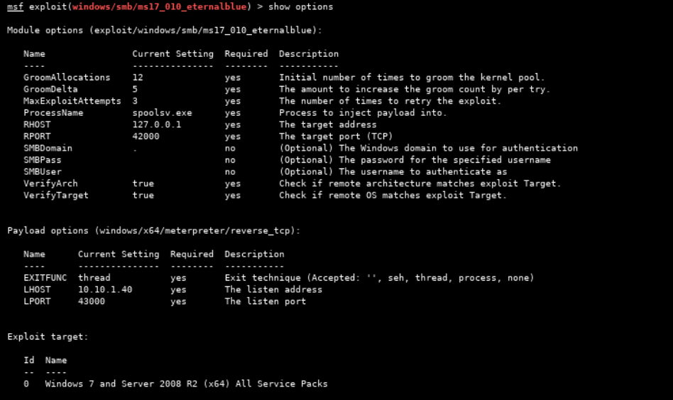
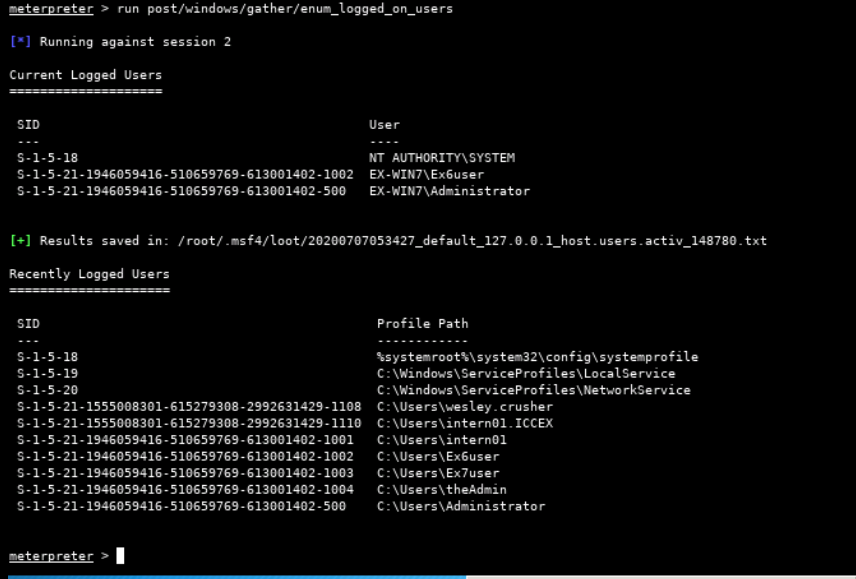

# ICC Security - Exercise 06 - Malware

Setting up SSH tunnels

```
                Attack Machine              Jump Point                  Target
                (Kali)                      (CentOS)                    (Windows 7)
                10.10.1.60                  10.10.1.40                  10.10.1.30
                +--------------+            +--------------+            +--------------+
                |              |            |              |            |              |
                |       [ephm] >------------> 22           |            |              |
                |              |            |              |            |              |
Fwd tunnel      |        42000 >============================------------> 445          |
                |              |            |              |            |              |
                |              |            |              |            |              |
Rev tunnel      |        43000 <=================== 43000 =<            |              |
                |              |            |              |            |              |
                |              |            |              |            |              |
                |              |            |              |            |              |
                +--------------+            +--------------+            +--------------+
```

Command used:

```
ssh intern01@10.10.1.40 -L 42000:10.10.1.30:445 -R 43000:127.0.0.1:43000
```

---

- Started script to capture all commands entered and output received:

```
cd ~
script icc_security_ex_06.txt
```

---

Fire up `sudo msfconsole` and get the exploit set up to attack the target.



First attempt failed due to not being able to verify target architecture. Set the "VerifyArch" option to false and try to run exploit again.

Also need to flush iptables rules on the jump point to ensure forwaring for forward and reverse traffic occurs as required. Firewall left enabled for all profiles on Win7 target.


Success - got a session to target through the SSH tunnels.


---

## Q1

What is the OS of the target?

```
Windows 7 (Build 7601, Service Pack 1)
```


## Q2

Take note of the memory load and system composition:

    How much RAM, swap space and paging space does the target have?
    Will running something crash the target?
    Will this cause any issues?
    What command was used to retrieve this information?

```
Target has physical memory available: 3,294 MB / 4,096 MB
Target has virtual memory available: 7,359 MB / 8,189 MB

Target has large amount of spare memory available, so not likely that running commands on it will cause the system to crash.

Info was retrieved using command:
- run multicommand -cl "systeminfo"
```


## Q3

What language is being used on the target? 

```
English (US)
```

## Q4

When was the target OS installed?

```
12/19/2017 8:17:44 AM
```

## Q5

Compare the outputs of the Windows dir command and the Meterpreter ls command:

    Use the multicommand script to run dir on the current working directory.
    Note the timestamp of one of the files.
    Use the Meterpreter command ls on the same file.
    Compare the time of the file in each instance.

Document the command/syntax used to determine the current date/time on the target.

```
Windows "dir" command (executed using - run multicommand -cl "cmd /c dir") provides file times (last modified) in local system time. Meterpreter "ls" command provides file times (last modified) referenced to UTC+0.

Meterpreter command to get system localtime: "localtime"
```


## Q6

Document the reason for any existing time difference between the two commands.

Note: For the purposes of this course, GMT, UTC and system time are synonymous.

```
The times differed between the native Windows "dir" command and the Meterpreter "ls" command due to the timezone to which the times were referenced. The native Windows "dir" command provides file times in the system local time (which was set to Eastern Standard Time), whereas the Meterpreter "ls" command provides the times in UTC+0.
```

## Q7

Are any users logged in to the target?

```
Yes
```

- Check using the `post/windows/gather/enum_logged_on_users` module, run within the meterpreter session.



## Q8

Document the command used to view tasks scheduled to run on this target.

```
run multicommand -cl "cmd /c schtasks /FO LIST
```

## Q9


```
- Auditing is enabled

- Logon of SYSTEM account related to out meterpreter session was logged in SECURITY event log (ID 4624) at 2020-07-07 01:19:24.576 (EST).
```


## Q10

Document the command used to verify the number of routable interfaces on the target.

```
route
```


## Q11

What type of network adapter(s) does the target have?


## Q12

```
Yes

- Dhcp service is running.
- NIC has DHCP enabled.
```


## Q13

How would an attacker enumerate a network using both Windows and Linux machines?

```
Conduct an ARP scan - this will enumerate all hosts up on the local subnet.
```

## Q14

Examine the process list and identify any malicious processes. Conduct internet research to complete the following tasks:

    Document the name of the malware
    Document the vendor/group that the malware is related to
    Document the malware's functionality by examining the DLLs associated with it

- No sign of persistence in registry run keys:


+++ TBC +++

## Q15

What security product is present?

```
MS Security Essentials
```

- The "WinDefend" service was observed running within svchost.exe (PID 2804)

Extract from: `run multicommand -cl "cmd /c tasklist /svc"


## Q16

Document if the standard system processes are legitimate
    lsass
    smss
    explorer
    csrss
    services
    winlogon
    etc.
Document if the non-standard system processes are legitimate

```
Standard and non-standard system processes were all found to be legitimate files signed by original company.
```


## Q17

+++

## Q18

+++

## Q19

Document any files that have updated since the target was exploited.

- Using command:
  - `run multicommand -cl "cmd /c dir C:\\ /S /OD | findstr \"07/07/2020\""`

## Q20

+++
