# ICC Security - Exercise 07 - Threats on the Target

1. Log on to Ubuntu VM (10.10.1.70) as intern01
   1. `su intern01`
2. Log on to Windows 2012 server (10.10.1.10) as ICCEX\Administrator
3. Switch to Kali box (10.10.1.60)
   1. Start script file to record commands entered and outputs received.
   2. Set up handler to catch reverse shell and execute.
4. Logon to Windows 10 machine (10.10.1.20) as user "ICCEX\intern01"
   1. Visit the site "downloads.iccex.com" and download the file "xmsol.zip"
   2. Unzip "zmsol.zip" using password "FreeGame"
   3. Run the file "xmsol.exe" as local Administrator.
5. Switch back over to Kali box and check that we have caught the reverse shell, starting a meterpreter session

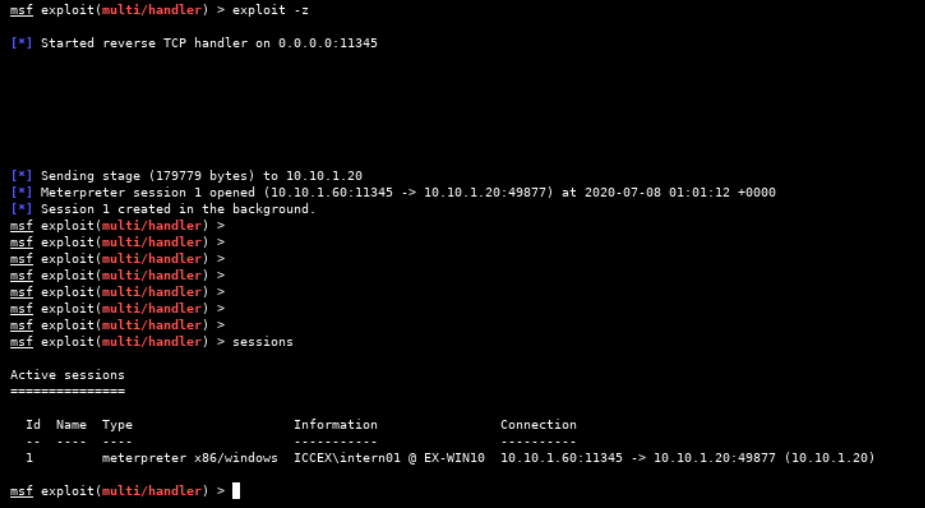

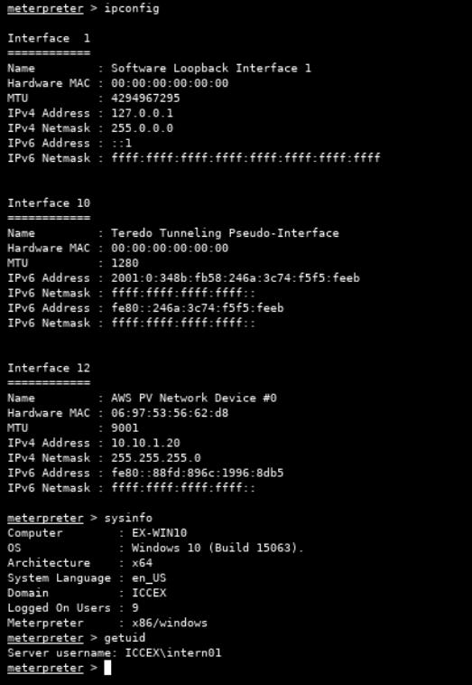

Target computer localtime at commencement of operation:


---

`run multicommand -cl "systeminfo"`

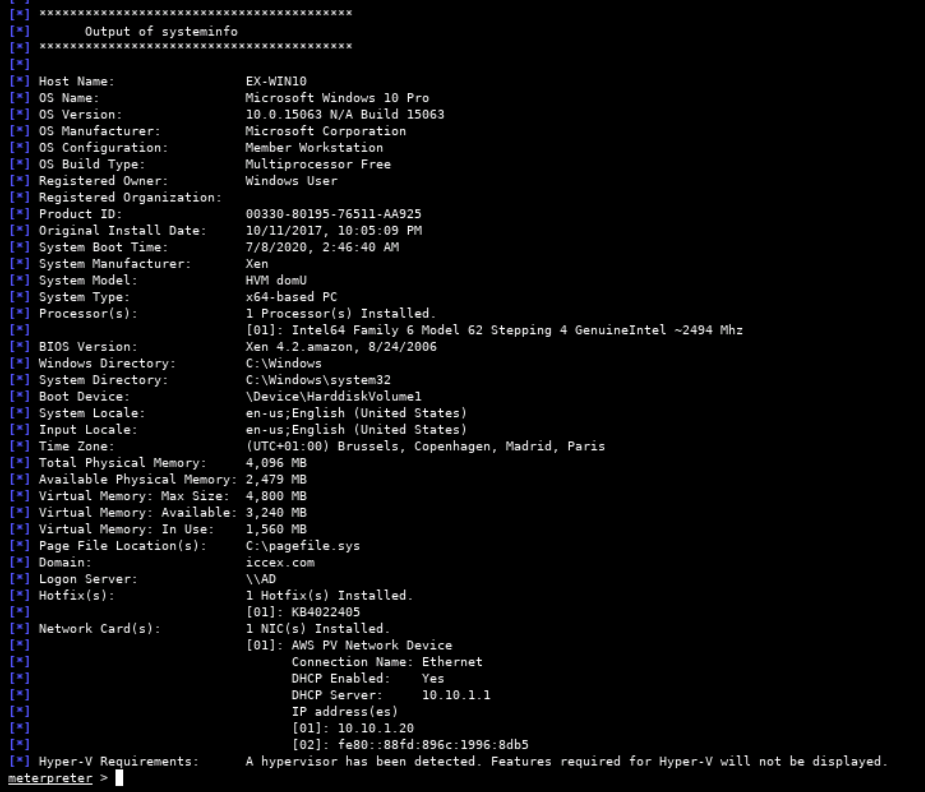

---

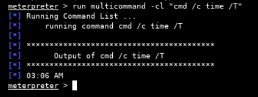

---

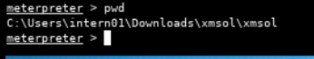

---

## Q9

```
PID 9780 (xmsol.exe)
```

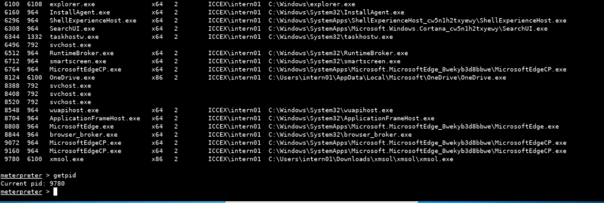

---

## Q10

Look at process list and services running within processes.

```
run multicommand -cl "cmd /c tasklist"
run multicommand -cl "cmd /c tasklist /svc"
```

## Q11

Document one security product process from the process list.

```
MsMpEng.exe

- Process is associated with Windows Defender. Observed to be running the "windefend" service.
```


---

## Q12

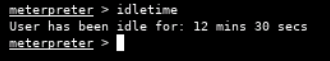

## Q13

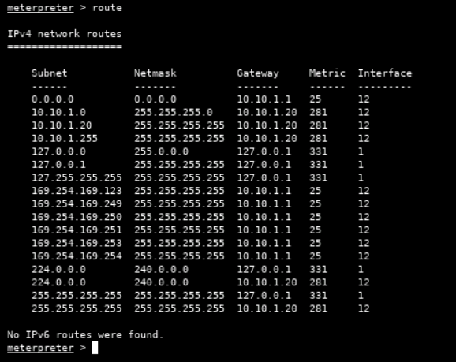

## Q14

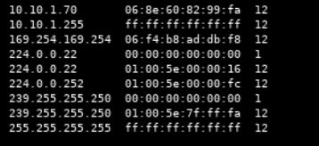

## Q15

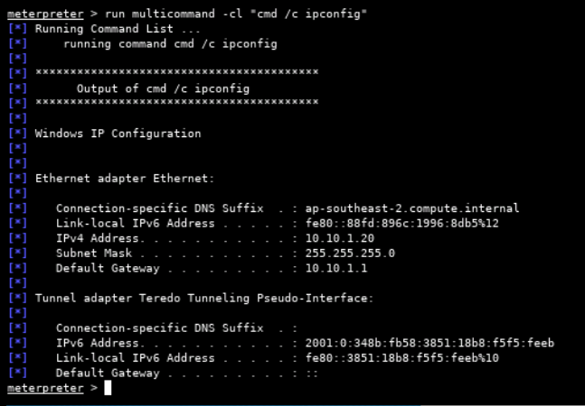

## Q16

Using command: `run multicommand -cl "cmd /c ipconfig /all".

Extract:

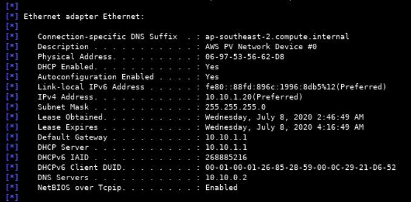

## Q17

Refer to native "systeminfo" command output.

```
iccex.com
```

## Q19

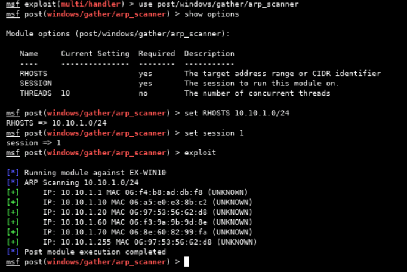

## Q20

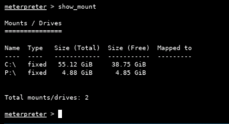

## Q21

5 local accounts on target.

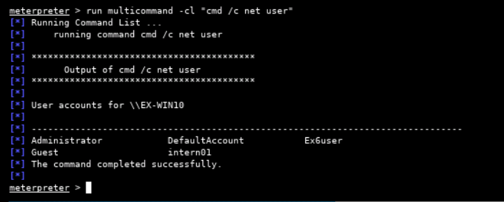

## Q23

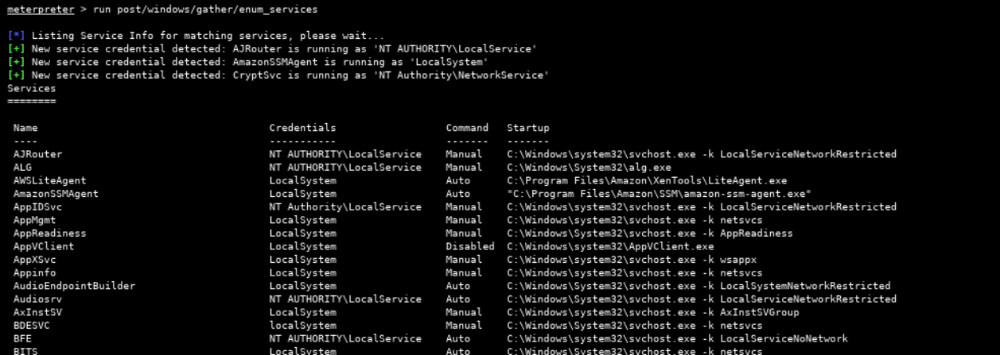

## Q24

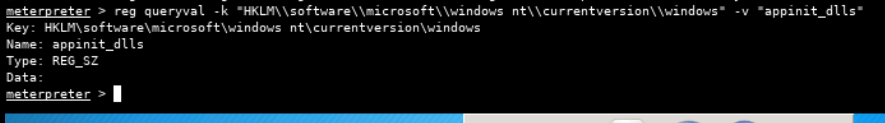

## Q25

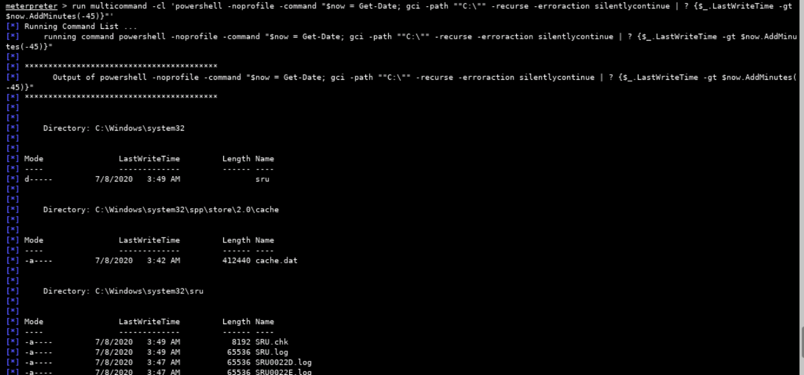

## Q26

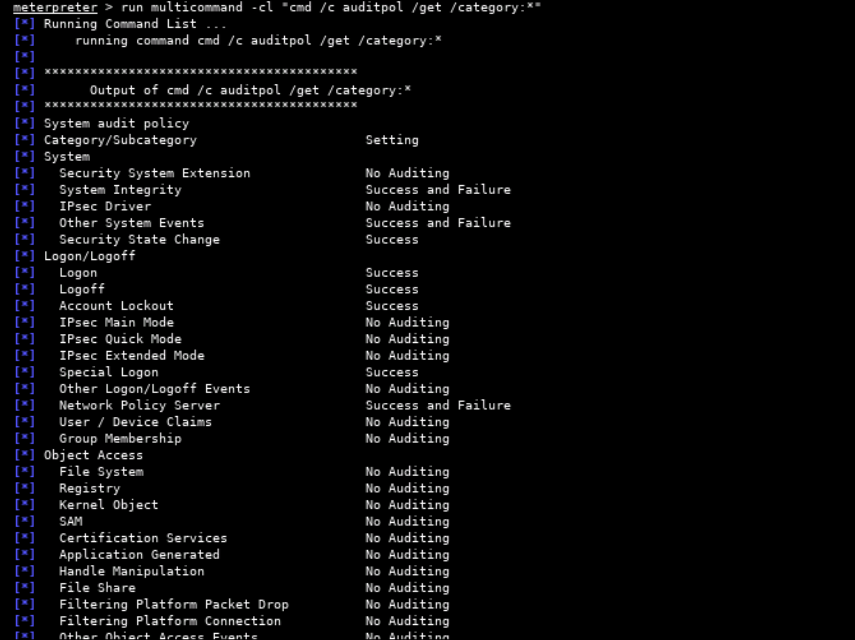

## Q27

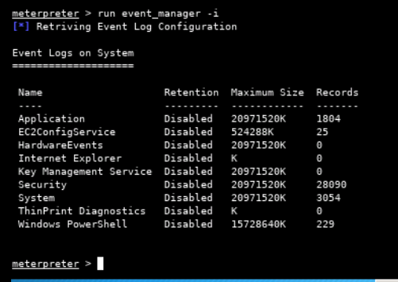

## Q28

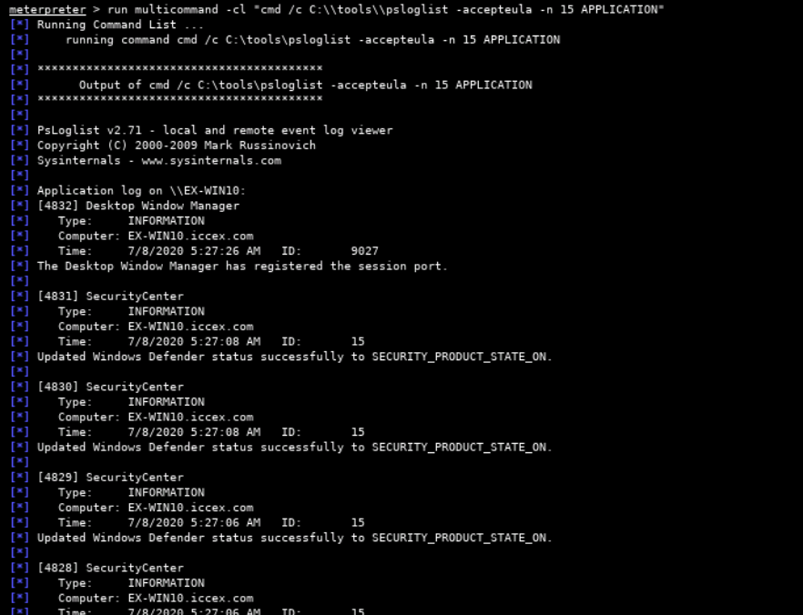

## Q29

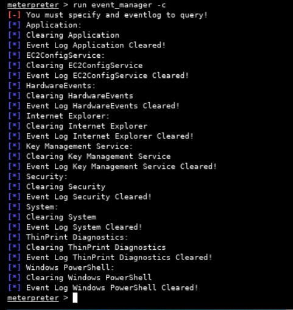

## Q30

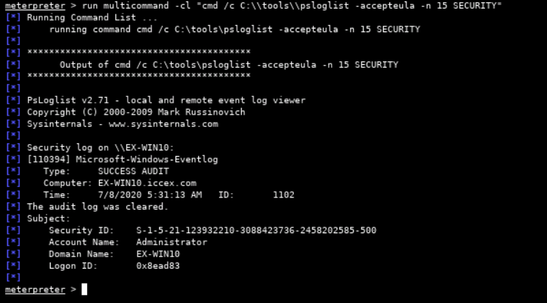

## Q31

Target computer has drives "C:\" and "P:\" mounted.

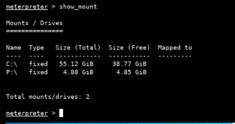

## Q32

```
run multicommand -cl "cmd /c schtasks"
```

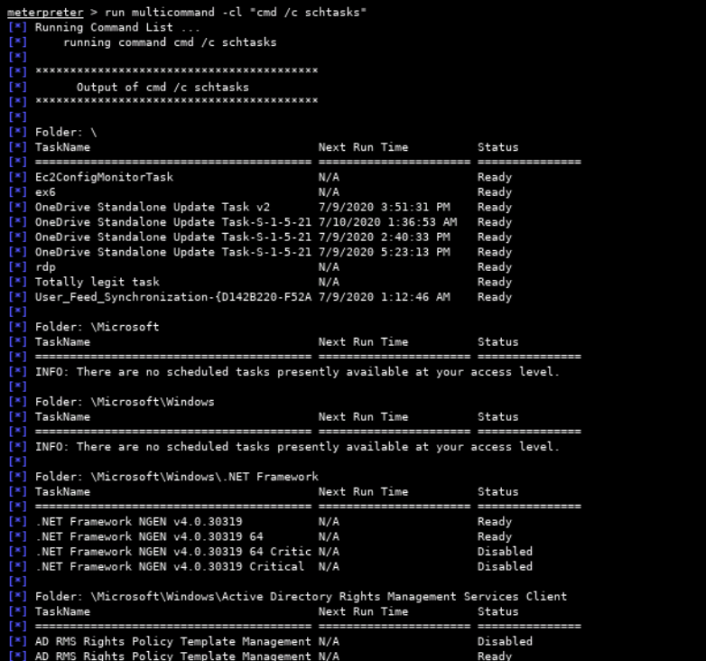

## Q33

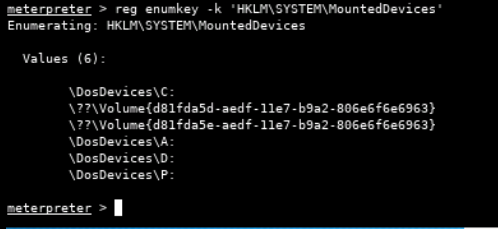

## Q34

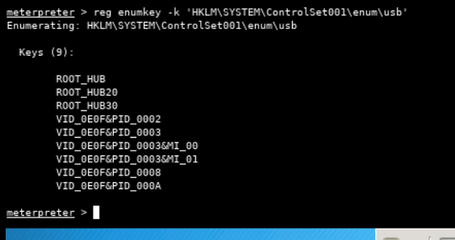

## Q35

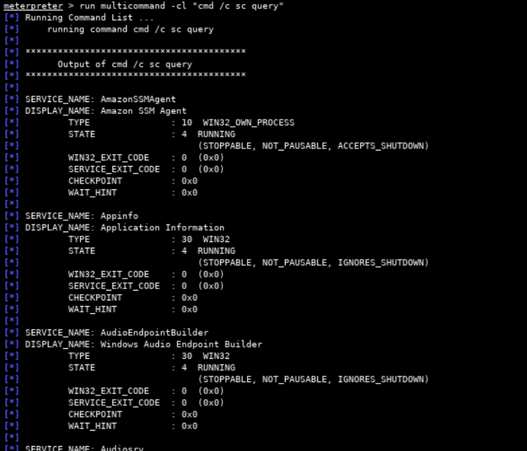

## Q36

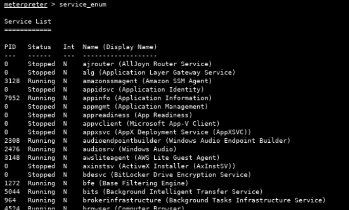

## Q37

PID 4056 (MsMpEng.exe)

## Q38, Q39

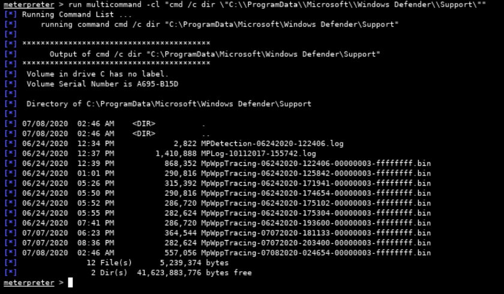

## Q40

Windows Defender registry key located at "HKLM\Software\Microsoft\Windows Defender". Cannot see this reg key when querying from Kali box through meterpreter session. However, reg key can be found when using regedit logged on directly to target box.

- Alternative method:
  - Drop into powershell shell from the meterpreter session, then run command: `Get-MpComputerStatus`

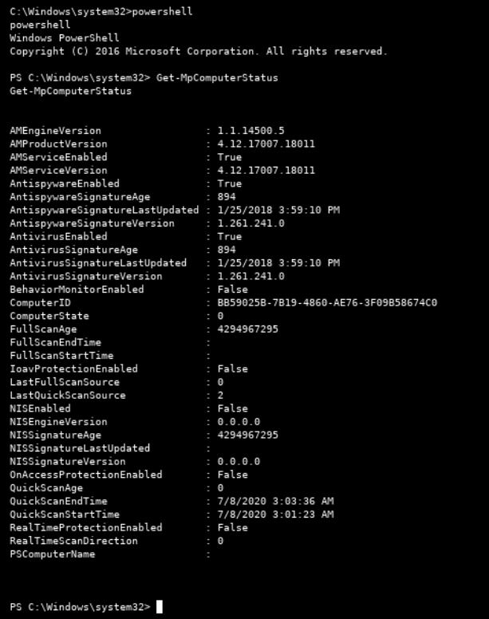
