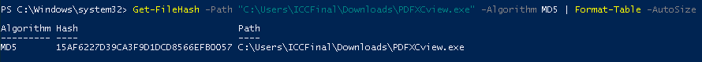

# ICC Security - Final Exam

## Q7

- Need to change LPORT - iptables on the jump point is causing the reverse shell to be dropped and not get back to the attack box.

## Q14

Yes - msseces.exe is the GUI for Microsoft Security Essentials.

## Q16

Windows 7

- conhost.exe introduced with Windows 7
- Microsoft Security Essentials was present up and including Windows 7, after which time it was replaced by the built-in Windows Defender application.

## Q18

Yes - apparently misnamed process "dvm.exe" is running. Possibly a replacement of the legitimate process "dwm.exe".

## Q19

Windows Server 2008 - process list indicates that computer is likely an AD Server, also serving DNS.

## Q20

- Adobe Creative Suite
  - Includes Adobe Acrobat Pro for PDFs
- Microsoft Office

## Q27

Yes - although second snippet was taken 45 minutes after the first snippet, the file timestamp is only 30 minutes ahead. This indicates that the file last modified time has been manipulated.

---

## Notes for practical element

Use sysinternals "autoruns" tool to get an initial overview of persistence locations which could point to a malware infection.

Found a suspicious task called "Totally legit task" listed under Task Scheduler.

Can only find the file in one location on disk.

`C:\Users\ICCFinal\Downloads\PDFXCview.exe`

Checking the file properties shows it claims to be signed by "Tracker Software Products (Canada) Ltd"

Calculate the file hash so we can look up the file on VirusTotal:

MD5: `15AF6227D39CA3F9D1DCD8566EFB0057`

## Q44

