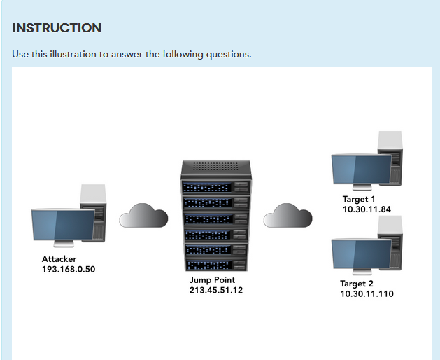
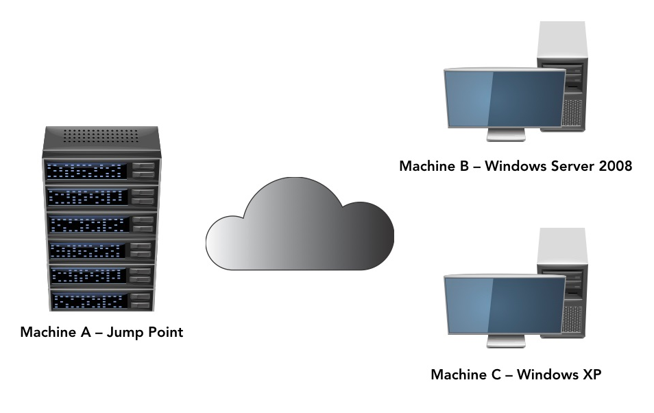
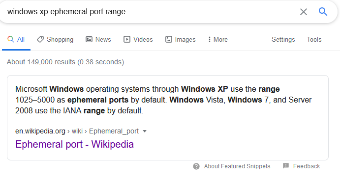
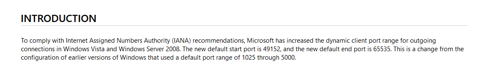

# ICC Security - Mid-term Exam



## Q7

```
A publically available exploit

> Since the box is already compromised, you don't want to risk your more valuable tools if a publically available tool will still achieve the desired outcome.
```

## INFO - Q10-11



## Q10

As an attacker, which of the following TCP port pairs would be preferable to use to exfiltrate data from Windows XP to Jump Point?

```
XP 1034 to Jump Point 443

> 1034 is within WinXP ehpm port range. TCP 443 can be used for HTTPS traffic to blend in with legitimate traffic.
```

## Q11





B       | C     |
--------|-------|
1036    | 1056  |   NY
49140   | 1134  |   NY
49160   | 49210 |   NN
52156   | 1140  |   YY

## Q12

```
- File Name - "svchost34.exe" stands out as not consistent with typical windows exe naming.
- File MAC time
- File MAC data
```

### Q13

```
dumprep32.exe - consistent with naming of other programs in the Windows XP "system32" directory.
```

## Q17

https://winaero.com/blog/find-shutdown-log-windows-10/

## Q18

Student Guide says centralised logging introduced in Windows Vista.

## Q20

Yes - at least one instance of the "explorer.exe" process.

